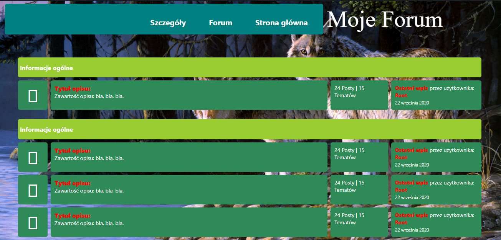
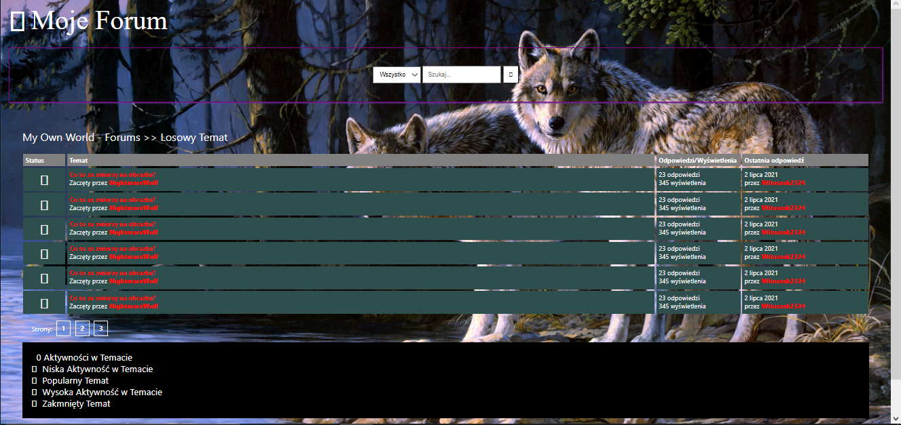
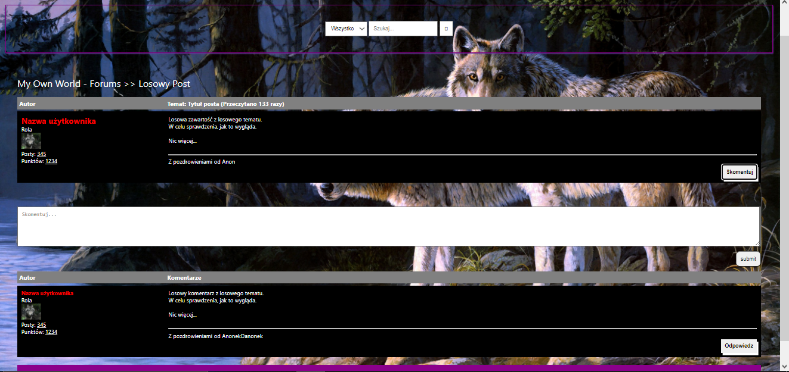

# My Own World Forum

## What's new?

PL: Nie ma żadnych nowych funkcji.

ENG: There is no new features.

## About project

PL: Szablon najprostszego forum stworzony w oparciu o HTML, CSS i JavaScript. Jest to projekt w ramach ćwiczeń w poruszaniu się
po technologiach front-endowych. Projekt ten powstał w oparciu o tutorial: https://www.youtube.com/watch?v=knGk9aUr4Do&list=LL&index=4

Poniżej znajduje się projekt strony głównej forum, listy postów oraz zawartość posta (szablon ukończony).
Szablon ten nie ma przyłączenia odnośników, dlatego trzeba nawigować ręcznie, wpisując na pasku przeglądarki odpowieni plik.
- Strona główna: index.html
- Posty: posts.html
- Szczegóły: details.html
Lub też otworzyć każdy plik z osobna.

Zrzuty ekranu:
Strona główna

Posty

Szczegóły

ENG: This is the simplest template of forum created with HTML, CSS and JavaScript. It is a project to familiarize with front-end technologies. This project was made with some help of this tutorial: https://www.youtube.com/watch?v=knGk9aUr4Do&list=LL&index=4

On an images attached above, you have view of prepared pages. One thing you should keep in mind is writing other names of pages to go to them in URL's browser.

## Technologies used in the project

* HTML
* CSS
* JavaScript

## Goals

PL: Projekt ten nie ma ściśle określonego celu.

ENG: This project has no general goal.

## License

My project is under BSD-2-Clause license. You can use some parts from my code but remember to credit me as an appreciation to my work! Thanks! Awoo!

© 2022 Paweł "Wilczeq/Vlk" Turoń
